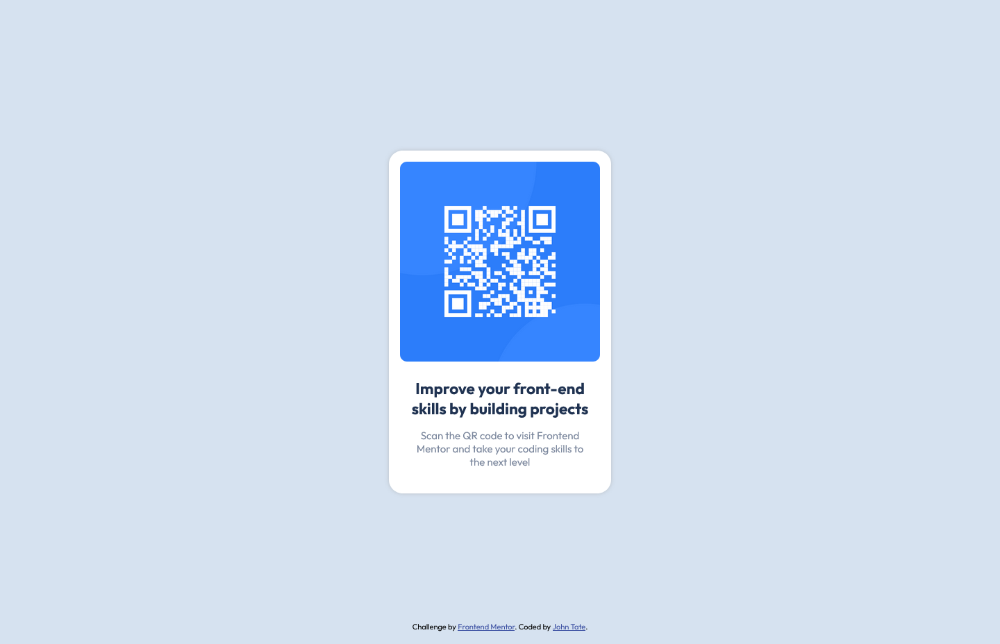

# Frontend Mentor - QR code component solution

This is a solution to the [QR code component challenge on Frontend Mentor](https://www.frontendmentor.io/challenges/qr-code-component-iux_sIO_H). Frontend Mentor challenges help you improve your coding skills by building realistic projects. 

## Table of contents

- [Overview](#overview)
  - [Screenshot](#screenshot)
  - [Links](#links)
- [My process](#my-process)
  - [Built with](#built-with)
  - [What I learned](#what-i-learned)
- [Author](#author)

## Overview

### Screenshot



### Links

- Solution URL: [Frontend Mentor Solution Page](https://www.frontendmentor.io/solutions/responsive-qr-code-component-GZoQQjIB4)
- Live Site URL: [Live Github Page](https://john-csm-tate.github.io/fem-qr-code-component/)

## My process

### Built with

- Semantic HTML5 markup
- CSS custom properties
- Flexbox
- Mobile-first workflow

### What I learned

- I used git and github for first time on a project.
- Learned that a height needs to be set for the body to be able to flex align-items vertically.

```css
body {
    min-height: 100vh;
    display: flex;
    align-items: center;
}
```

## Author

- Frontend Mentor - [@John-CSM-Tate](https://www.frontendmentor.io/profile/John-CSM-Tate)


